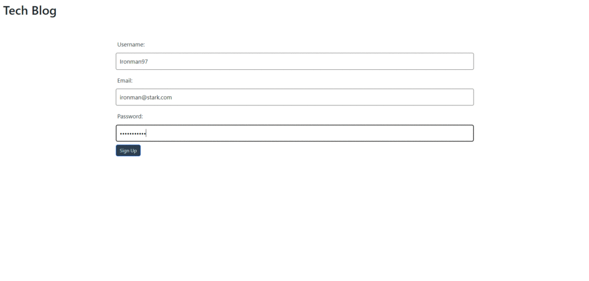

# CMS-Style-Blog

## Intro
The CMS Style Blog is a full stack web application that allows users to register an account, login, make and view posts, as well as comment on other's posts.

## Usage
The website is hosted on render, so the only thing needed to run the application is to visit through the render link.

## URLs
[Github Repo](https://github.com/aharper2568/CMS-Style-Blog)\
[Live URL](https://cms-style-blog.onrender.com/)

## Screenshots

## Author

Developed in VSCode by **Anthony Harper**